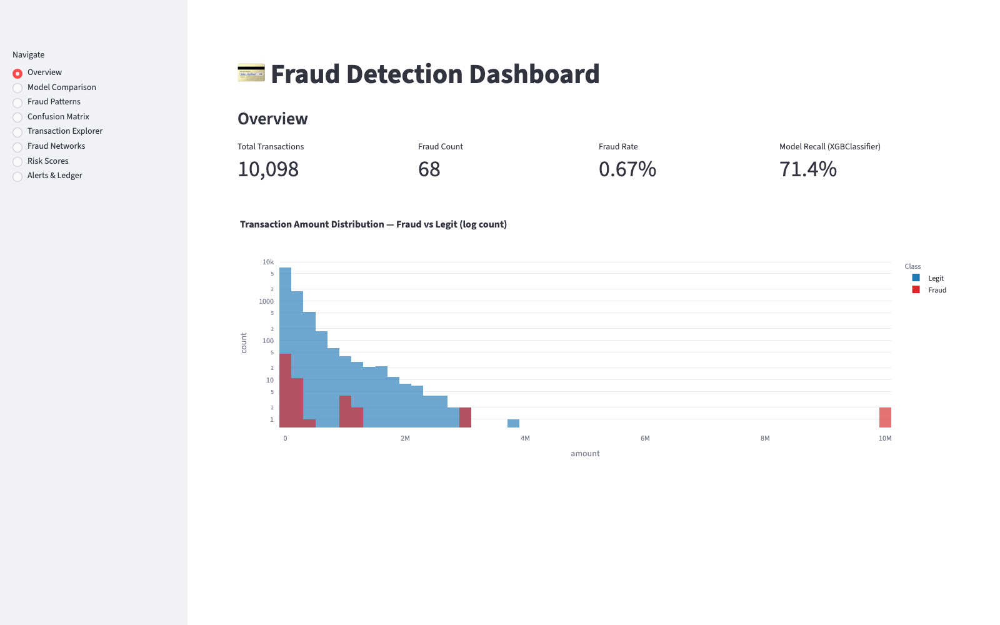
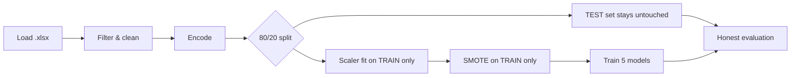
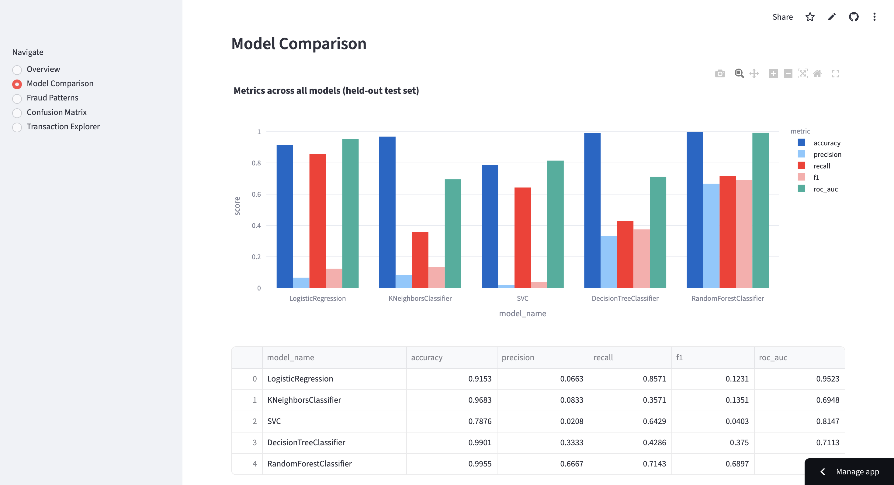
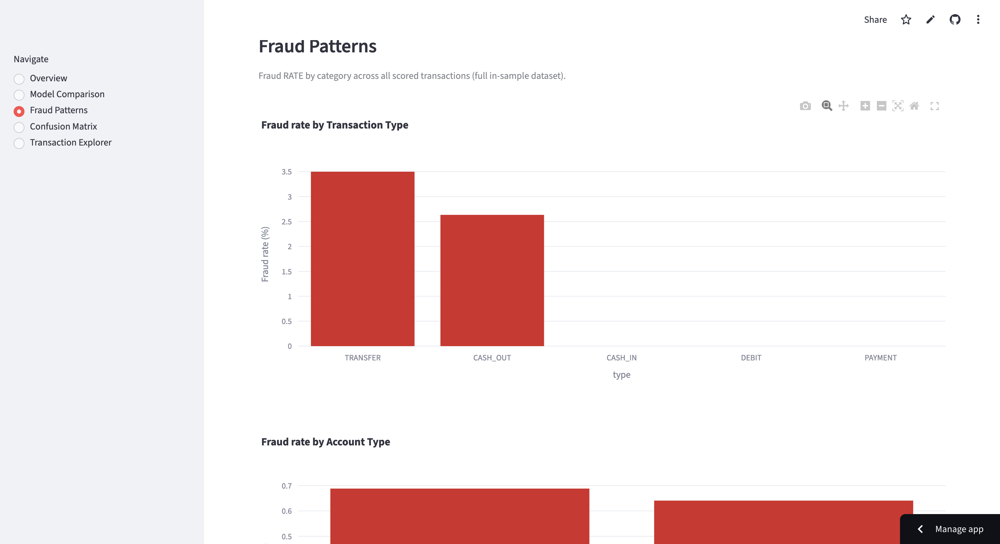
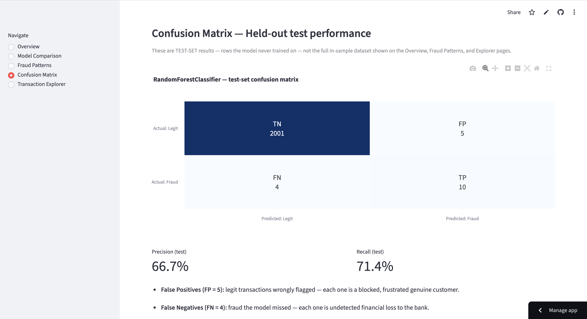
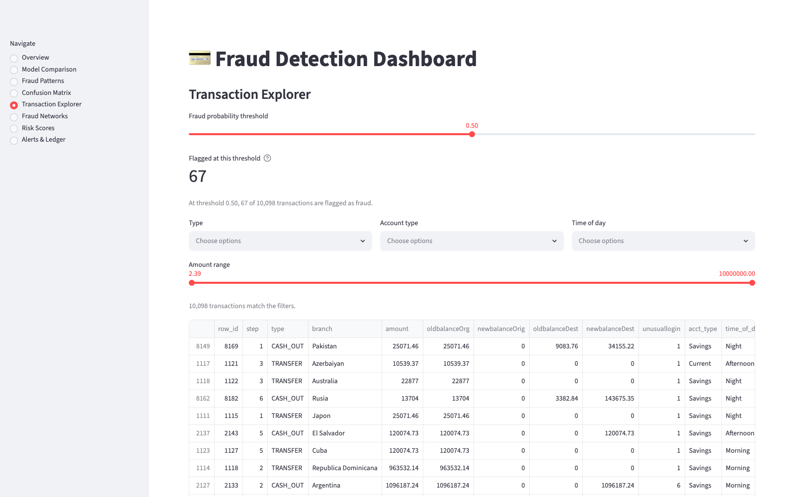

<div align="center">

# 💳 Financial Fraud Detection System

**Machine-learning pipeline + interactive Streamlit dashboard for real-time fraud scoring on extremely imbalanced transaction data**

[](https://fraud-detection-scope.streamlit.app)


| 🎯 ROC-AUC | 🔍 Fraud Recall | 📊 Transactions | 🤖 Models Compared |
|:---:|:---:|:---:|:---:|
| **0.9933** | **71.4%** | **10,098** | **5** |



</div>

---

## ✨ What it does

Fraud is rare but expensive — in this dataset only **0.67%** of transactions are fraudulent
(68 out of 10,098). A naive model predicting "safe" for everything scores 99.3% accuracy
while catching **zero** fraud. This project handles that imbalance properly:

1. **🔬 Model pipeline** — trains and honestly compares 5 classifiers on a leakage-free
   pipeline, then saves the best model (Random Forest).
2. **📊 Interactive dashboard** — 5-page Streamlit app with live fraud scoring, an
   adjustable risk threshold, and pattern analysis — deployed on Streamlit Cloud.

## 🛡️ Leakage-free by design

The #1 failure mode in imbalanced-data projects is data leakage. The pipeline order here
guarantees honest metrics:



- **RobustScaler** fitted on the training split only — test is transformed, never refitted
- **SMOTE** balances the training split only (54 → 8,024 fraud rows); the test set keeps
  its natural 2,006 / 14 distribution
- `random_state=42` everywhere → fully reproducible

## 🏆 Results (held-out test set)

| Model | Accuracy | Precision | Recall | F1 | ROC-AUC |
|---|---:|---:|---:|---:|---:|
| Logistic Regression | 0.9153 | 0.0663 | 0.8571 | 0.1231 | 0.9523 |
| K-Nearest Neighbors | 0.9683 | 0.0833 | 0.3571 | 0.1351 | 0.6948 |
| SVC (RBF) | 0.7876 | 0.0208 | 0.6429 | 0.0403 | 0.8147 |
| Decision Tree | 0.9901 | 0.3333 | 0.4286 | 0.3750 | 0.7113 |
| **Random Forest** 🥇 | **0.9955** | **0.6667** | **0.7143** | **0.6897** | **0.9933** |

**Confusion matrix (2,020 unseen transactions):** TN 2,001 · FP 5 · FN 4 · TP 10 —
the model catches **10 of 14** unseen fraud cases while wrongly flagging only **5 of 2,006**
legitimate customers.

## 📸 Dashboard tour

<details>
<summary><b>📈 Model Comparison</b> — all 5 metrics across all 5 models</summary>

</details>

<details>
<summary><b>🔥 Fraud Patterns</b> — fraud <i>rate</i> by type, account, time of day</summary>

</details>

<details>
<summary><b>🎯 Confusion Matrix</b> — held-out test performance, honestly labeled</summary>

</details>

<details>
<summary><b>🔍 Transaction Explorer</b> — live threshold slider + real-time scoring form</summary>

</details>

The Explorer's **risk-threshold slider re-flags transactions live** — drag it and watch the
flagged count change. A "Score a New Transaction" form runs the trained model on manual
input in real time.

## 🚀 Quickstart

```bash
git clone https://github.com/tanmay866/fraud-detection && cd fraud-detection
python3 -m venv .venv && source .venv/bin/activate
pip install -r requirements.txt
```

Place the dataset at `data/Fraud_Detection.xlsx` (data files are gitignored), then:

```bash
python src/preprocess.py     # shapes + class balance before/after SMOTE
python src/etl.py            # ETL → SQLite database (output/fraud_detection.db)
python src/train.py          # 10-model comparison → metrics CSVs + best_model.pkl
python src/score.py          # full-dataset scoring → scored_transactions.csv
python src/graph_analysis.py # fraud network detection (account graph)
python src/stream_monitor.py # simulated real-time stream + fraud alerts
python src/risk_scoring.py   # AI-driven customer risk scores (A–E tiers)
python src/blockchain_ledger.py # tamper-evident hash-chained ledger of flagged txns
streamlit run app.py         # dashboard at localhost:8501
```

Mobile push alerts: install the free [ntfy](https://ntfy.sh) app, subscribe to a topic, then
`NTFY_TOPIC=<your-topic> python src/stream_monitor.py` — every fraud alert lands on your phone.

## 📁 Project structure

```
fraud-detection/
├── CLAUDE.md            # full project spec (source of truth)
├── app.py               # 5-page Streamlit dashboard
├── data/                # Fraud_Detection.xlsx (gitignored)
├── src/
│   ├── preprocess.py    # load → filter → encode → split → scale → SMOTE (train only)
│   ├── etl.py           # ETL: cleaned data → SQLite (fraud_detection.db)
│   ├── train.py         # 7 supervised + 3 unsupervised models, save best by ROC-AUC
│   ├── score.py         # score full dataset with saved model/scaler/encoders
│   ├── graph_analysis.py# account-graph fraud network detection
│   ├── stream_monitor.py# simulated stream + alerts (console/CSV/email/mobile)
│   ├── risk_scoring.py  # AI-driven customer risk scores (A–E tiers)
│   └── blockchain_ledger.py # SHA-256 hash-chained ledger + tamper detection
├── models/              # best_model.pkl, scaler.pkl, encoders.pkl
└── output/              # metrics + scored CSVs, fraud_detection.db, alerts, networks
```

## 🧰 Tech stack

`Python` · `pandas` · `scikit-learn` · `XGBoost` · `LightGBM` · `imbalanced-learn (SMOTE)` · `SQLite` · `joblib` · `Plotly` · `Streamlit`

---

<div align="center">

**Tanmay Patel** · Zidio Development — Data Analytics Internship · 2026

[🚀 Live Demo](https://fraud-detection-scope.streamlit.app) · [📦 Repository](https://github.com/tanmay866/fraud-detection)

</div>
