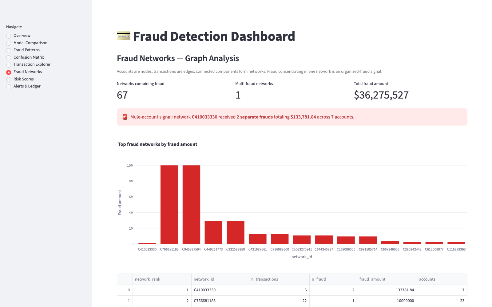
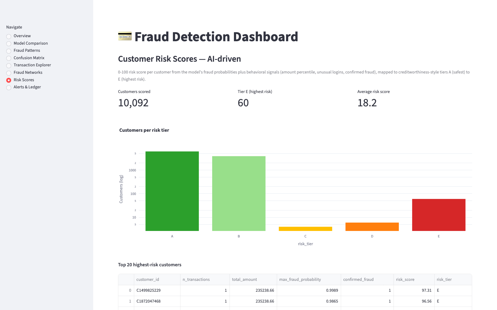
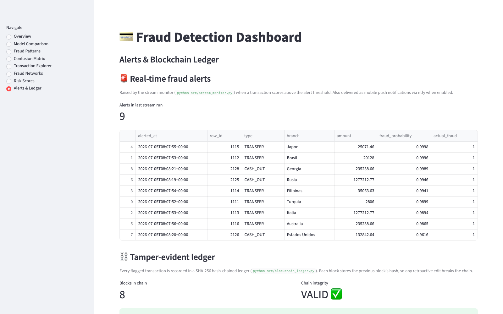
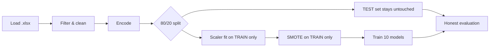

<div align="center">

# 💳 Financial Fraud Detection System

**Machine-learning pipeline · real-time monitoring suite · interactive dashboard**
**for fraud scoring on extremely imbalanced transaction data**

[](https://fraud-detection-scope.streamlit.app)


| 🎯 ROC-AUC | 🔍 Fraud Recall | ✅ Precision | 📊 Transactions | 🤖 Models |
|:---:|:---:|:---:|:---:|:---:|
| **0.9976** | **71.4%** | **76.9%** | **10,098** | **10** |

<a href="https://fraud-detection-scope.streamlit.app"></a>

[**✨ Features**](#-what-it-does) · [**📸 Screenshots**](#-dashboard-gallery) · [**🏆 Results**](#-results-held-out-test-set) · [**🚀 Quickstart**](#-quickstart)

</div>

---

## ✨ What it does

Fraud is rare but expensive — in this dataset only **0.67%** of transactions are fraudulent
(68 out of 10,098). A naive model predicting "safe" for everything scores 99.3% accuracy
while catching **zero** fraud. This project handles that imbalance properly, end to end:

| | Component | What it delivers |
|---|---|---|
| 🔬 | **10-model pipeline** | 7 supervised classifiers + 3 unsupervised anomaly detectors, honestly compared on a leakage-free pipeline — **XGBoost** wins and is deployed |
| 🗄️ | **ETL → SQLite** | Cleaned transactions loaded into `fraud_detection.db`, feeding the monitoring stack |
| 🕸️ | **Graph analysis** | Account-network detection via union-find — surfaced a real **mule account** receiving 2 frauds worth **$133,781** |
| 🚨 | **Real-time monitoring** | Simulated transaction stream scored live; alerts to console, CSV, e-mail, and **your phone** (ntfy push — tested live) |
| 🏦 | **AI risk scoring** | Every customer rated 0–100 and tiered **A–E** from model probabilities + behavior |
| ⛓️ | **Blockchain ledger** | Flagged transactions in a SHA-256 hash chain — tampering is **detected live** in the dashboard |
| 📊 | **8-page dashboard** | Live threshold tuning, real-time scoring form, deep-linkable pages — deployed on Streamlit Cloud |

## 📸 Dashboard gallery

*Every screenshot links to that page of the live app.*

<table>
  <tr>
    <td align="center" width="50%">
      <a href="https://fraud-detection-scope.streamlit.app/?page=Model+Comparison"></a>
      <br><b>📈 Model Comparison</b><br><sub>5 metrics × 10 models, best-model callout</sub>
    </td>
    <td align="center" width="50%">
      <a href="https://fraud-detection-scope.streamlit.app/?page=Transaction+Explorer"></a>
      <br><b>🔍 Transaction Explorer</b><br><sub>live threshold slider re-flags in real time + scoring form</sub>
    </td>
  </tr>
  <tr>
    <td align="center">
      <a href="https://fraud-detection-scope.streamlit.app/?page=Fraud+Networks"></a>
      <br><b>🕸️ Fraud Networks</b><br><sub>graph analysis — mule-account detection</sub>
    </td>
    <td align="center">
      <a href="https://fraud-detection-scope.streamlit.app/?page=Risk+Scores"></a>
      <br><b>🏦 Risk Scores</b><br><sub>AI-driven customer tiers A–E</sub>
    </td>
  </tr>
  <tr>
    <td align="center">
      <a href="https://fraud-detection-scope.streamlit.app/?page=Alerts+%26+Ledger"></a>
      <br><b>⛓️ Alerts & Ledger</b><br><sub>alert queue + live-verified hash chain</sub>
    </td>
    <td align="center">
      <a href="https://fraud-detection-scope.streamlit.app/?page=Confusion+Matrix"></a>
      <br><b>🎯 Confusion Matrix</b><br><sub>held-out test performance, honestly labeled</sub>
    </td>
  </tr>
  <tr>
    <td align="center" colspan="2">
      <a href="https://fraud-detection-scope.streamlit.app/?page=Fraud+Patterns"></a>
      <br><b>🔥 Fraud Patterns</b><br><sub>fraud <i>rate</i> by type, account, time of day + heatmap</sub>
    </td>
  </tr>
</table>

## 🛡️ Leakage-free by design

The #1 failure mode in imbalanced-data projects is data leakage. The pipeline order here
guarantees honest metrics:



- **RobustScaler** fitted on the training split only — test is transformed, never refitted
- **SMOTE** balances the training split only (54 → 8,024 fraud rows); the test set keeps
  its natural 2,006 / 14 distribution
- **Unsupervised detectors** fit on original legit rows only — never on synthetic SMOTE output
- `random_state=42` everywhere → fully reproducible

## 🏆 Results (held-out test set)

| Model | Accuracy | Precision | Recall | F1 | ROC-AUC |
|---|---:|---:|---:|---:|---:|
| Logistic Regression | 0.9153 | 0.0663 | 0.8571 | 0.1231 | 0.9523 |
| K-Nearest Neighbors | 0.9683 | 0.0833 | 0.3571 | 0.1351 | 0.6948 |
| SVC (RBF) | 0.7876 | 0.0208 | 0.6429 | 0.0403 | 0.8147 |
| Decision Tree | 0.9901 | 0.3333 | 0.4286 | 0.3750 | 0.7113 |
| Random Forest | 0.9955 | 0.6667 | 0.7143 | 0.6897 | 0.9933 |
| **XGBoost** 🥇 | **0.9965** | **0.7692** | **0.7143** | **0.7407** | **0.9976** |
| LightGBM | 0.9965 | 0.7692 | 0.7143 | 0.7407 | 0.9466 |
| Isolation Forest* | 0.9812 | 0.0385 | 0.0714 | 0.0500 | 0.5818 |
| One-Class SVM* | 0.9807 | 0.0370 | 0.0714 | 0.0488 | 0.5972 |
| Autoencoder (MLP)* | 0.9837 | 0.0870 | 0.1429 | 0.1081 | 0.8165 |

\* Unsupervised anomaly detectors — trained without labels, shown for comparison.

**Confusion matrix (2,020 unseen transactions):** TN 2,003 · FP 3 · FN 4 · TP 10 —
the model catches **10 of 14** unseen fraud cases while wrongly flagging only **3 of 2,006**
legitimate customers.

## 🚀 Quickstart

```bash
git clone https://github.com/tanmay866/fraud-detection && cd fraud-detection
python3 -m venv .venv && source .venv/bin/activate
pip install -r requirements.txt
```

Place the dataset at `data/Fraud_Detection.xlsx` (data files are gitignored), then:

```bash
python src/preprocess.py     # shapes + class balance before/after SMOTE
python src/etl.py            # ETL → SQLite database (output/fraud_detection.db)
python src/train.py          # 10-model comparison → metrics CSVs + best_model.pkl
python src/score.py          # full-dataset scoring → scored_transactions.csv
python src/graph_analysis.py # fraud network detection (account graph)
python src/stream_monitor.py # simulated real-time stream + fraud alerts
python src/risk_scoring.py   # AI-driven customer risk scores (A–E tiers)
python src/blockchain_ledger.py # tamper-evident hash-chained ledger of flagged txns
streamlit run app.py         # dashboard at localhost:8501
```

📱 **Mobile alerts:** install the free [ntfy](https://ntfy.sh) app, subscribe to a topic, then
`NTFY_TOPIC=<your-topic> python src/stream_monitor.py` — every fraud alert lands on your phone.

🔗 **Deep links:** open any dashboard page directly, e.g.
[`?page=Fraud+Networks`](https://fraud-detection-scope.streamlit.app/?page=Fraud+Networks).

## 📁 Project structure

```
fraud-detection/
├── REPORT.pdf           # full project report (19 pages)
├── app.py               # 8-page Streamlit dashboard
├── data/                # Fraud_Detection.xlsx (gitignored)
├── src/
│   ├── preprocess.py    # load → filter → encode → split → scale → SMOTE (train only)
│   ├── etl.py           # ETL: cleaned data → SQLite (fraud_detection.db)
│   ├── train.py         # 7 supervised + 3 unsupervised models, save best by ROC-AUC
│   ├── score.py         # score full dataset with saved model/scaler/encoders
│   ├── graph_analysis.py# account-graph fraud network detection
│   ├── stream_monitor.py# simulated stream + alerts (console/CSV/email/mobile)
│   ├── risk_scoring.py  # AI-driven customer risk scores (A–E tiers)
│   └── blockchain_ledger.py # SHA-256 hash-chained ledger + tamper detection
├── models/              # best_model.pkl, scaler.pkl, encoders.pkl
└── output/              # metrics + scored CSVs, fraud_detection.db, alerts, networks
```

## 🧰 Tech stack

`Python` · `pandas` · `scikit-learn` · `XGBoost` · `LightGBM` · `imbalanced-learn (SMOTE)` · `SQLite` · `joblib` · `Plotly` · `Streamlit`

---

<div align="center">

**Tanmay Patel** · Zidio Development — Data Analytics Internship · 2026

[🚀 Live Demo](https://fraud-detection-scope.streamlit.app) · [📦 Repository](https://github.com/tanmay866/fraud-detection) · [📄 Full Report](REPORT.pdf)

</div>
